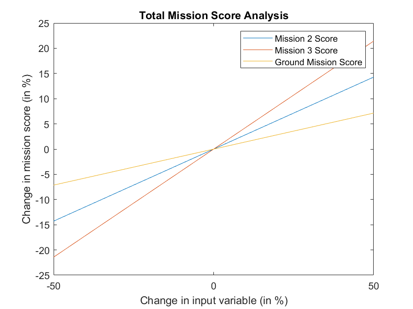
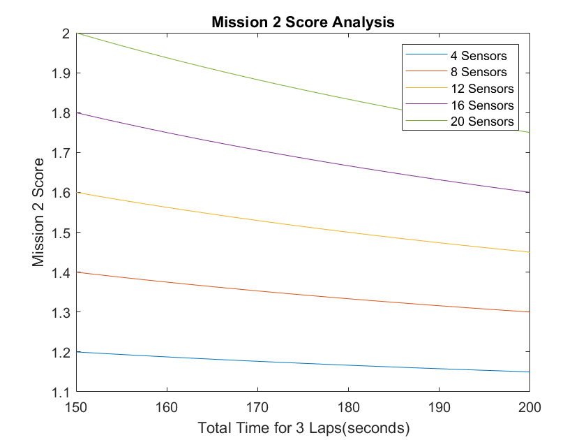
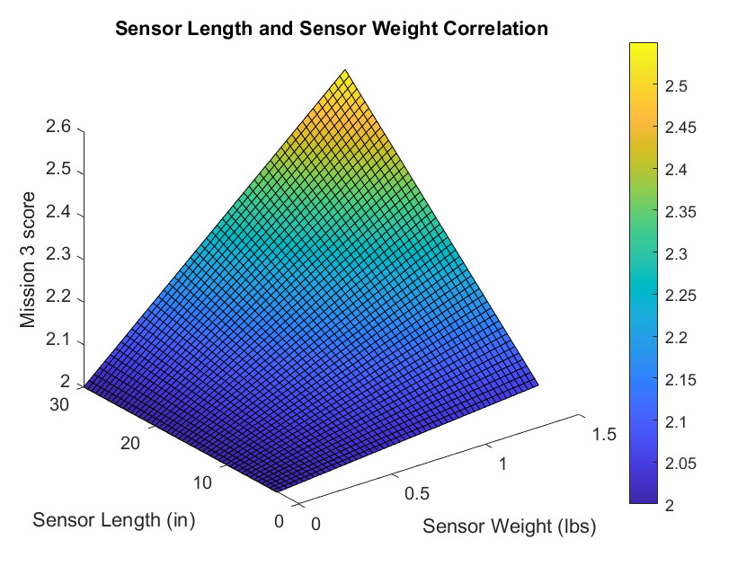

# Sensitivity Analysis with MATLAB for Student Competition Scores

  

<!-- Add this icon to the README if this repo also appears on File Exchange via the "Connect to GitHub" feature --> 

## Introduction

Sensitivity Analysis (SA) is a technique used to measure the impact of uncertainties in input variables on output variables in a model. SA aims to determine which input variables impact the output most and identify the range of values in which the model is most sensitive. This information helps to design a robust model with reduced uncertainties. 

SA is practiced in a range of fields, including but not limited to finance, engineering, and economics. Specifically, in the field of engineering design, it helps engineers optimize their designs and to improve the quality, reliability, and performance of the system. Model aircraft design competitions, such as the AIAA DBF and SAE Aero Design, are no exception. SA is used here specifically to evaluate score sensitivity. It helps teams identify the most sensitive design variables and optimize their vehicle designs to maximize their score.

For the current demo, our attention will be on the student competition score function. Especially competitions focused on model aircraft design, i.e., AIAA Design Build Fly, SAE AeroDesign, etc., as a case study to investigate how distinctive design variables affect the mission score. To demonstrate this, we will use the scoring function, from the AIAA Design Build Fly Competition 2021 Rule Book, with MATLAB plotting approach. By the end of this demo, you will better understand how to make informed design choices to optimize the competition score.

<table>
<tr>
<td>  </td>
<td>  </td>
</tr>
<tr>
<td>  </td>
<td>  </td>
</tr>
</table>

<!--- If your project includes a visualation or any images or an App please include a screenshot in this README --->

## Setup
To run: 
1. Download the repository and extract it to your local directory. 
2. In the MATLAB environment make this directory as current folder. 
3. Open the file either by double clicking on the  'Sensivity_Analysis_with_MATLAB_for_Student_Competition_Score.mlx' in the Current Folder Window or by running  the command, open('Sensivity_Analysis_with_MATLAB_for_Student_Competition_Score')  in MATLAB Command Window.
4. Run the file by clicking on the Run Button available in the Live Editor menu bar. 

## MathWorks Products (https://www.mathworks.com)
<!--- Make sure you have a License.txt within your Repo --->
1. MATLAB release R2022a or higher

## Additional resources
Learn MATLAB with following resources
1. [MATLAB Onramp](https://matlabacademy.mathworks.com/details/matlab-onramp/gettingstarted)
2. [Explore MATLAB Examples and Documentation](https://in.mathworks.com/help/matlab/getting-started-with-matlab.html)
3. [Get Started with Introductory MATLAB Videos](https://in.mathworks.com/videos.html#matlabgetstarted)

## License
<!--- Make sure you have a License.txt within your Repo --->

The license for Sensitivity Analysis with MATLAB for Student Competition Scores is available in the License.txt file in this GitHub repository.

### 

For any queries, contact the authors at roboticsarena@mathworks.com
<!--- Make sure you have a License.txt within your Repo --->

<!--- Make sure you have a License.txt within your Repo --->
Copyright 2023 The MathWorks, Inc.

