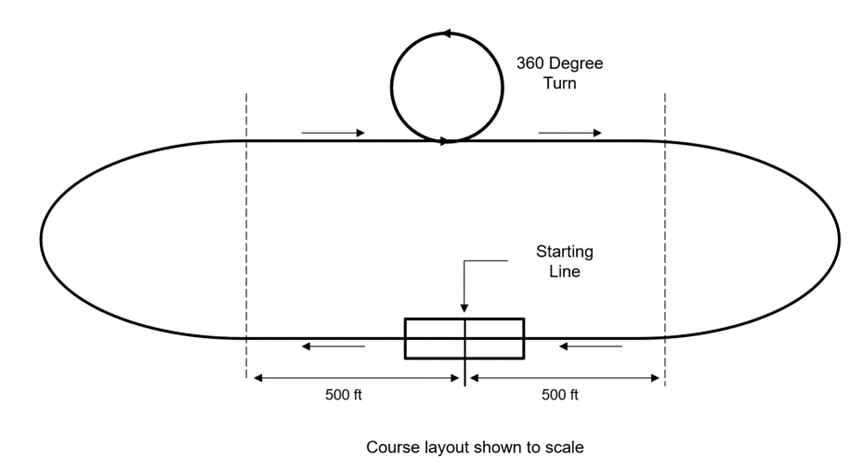

# Sensitivity Analysis with MATLAB for Student Competition Scores

<!-- Add this icon to the README if this repo also appears on File Exchange via the "Connect to GitHub" feature --> 

## Introduction

This repository presents the MATLAB plotting approach for performing Sensitivity Analysis (SA) for student competitions. It is used here specifically to evaluate score sensitivity. It helps teams identify the most sensitive design variables and optimize their vehicle designs to maximize their overall score.

This code discusses the design parameter sensitivity for the student competition score function, especially competitions focused on model aircraft design, i.e., AIAA Design Build Fly, SAE Aero Design, etc. It helps to investigate how distinctive design variables affect the mission score. To demonstrate this, we will use the scoring function from the AIAA Design Build Fly Competition 2021 Rule Book, with the MATLAB plotting approach. By the end of this demo, you will better understand how to make informed design choices to optimize the competition score.

<table>
<tr>
<td>  </td>
<td>  </td>
</tr>
<tr>
<td>  </td>
<td>  </td>
</tr>
</table>

### Learn more with the detailed video

<!--- If your project includes a visualization or any images or an App please include a screenshot in this README --->

## Setup
To run: 
1. Download the repository and extract it to your local directory. 
2. In the MATLAB environment, make this directory as current folder. 
3. Open the file either by double clicking on the  'Sensivity_Analysis_with_MATLAB_for_Student_Competition_Score.mlx' in the Current Folder Window or by running  the command, open('Sensivity_Analysis_with_MATLAB_for_Student_Competition_Score')  in MATLAB Command Window.
4. Run the file by clicking on the Run Button available in the Live Editor menu bar. 

## MathWorks Products (https://www.mathworks.com)
<!--- Make sure you have a License.txt within your Repo --->
1. MATLAB release R2022a or higher

## Additional resources
Learn MATLAB with the following resources
1. [MATLAB Onramp](https://matlabacademy.mathworks.com/details/matlab-onramp/gettingstarted)
2. [Explore MATLAB Examples and Documentation](https://in.mathworks.com/help/matlab/getting-started-with-matlab.html)
3. [Get Started with Introductory MATLAB Videos](https://in.mathworks.com/videos.html#matlabgetstarted)

## License
<!--- Make sure you have a License.txt within your Repo --->

The license for Sensitivity Analysis with MATLAB for Student Competition Scores is available in the License.txt file in this GitHub repository.

### 

For any queries, contact the authors at roboticsarena@mathworks.com
<!--- Make sure you have a License.txt within your Repo --->

<!--- Make sure you have a License.txt within your Repo --->
Copyright 2023 The MathWorks, Inc.

